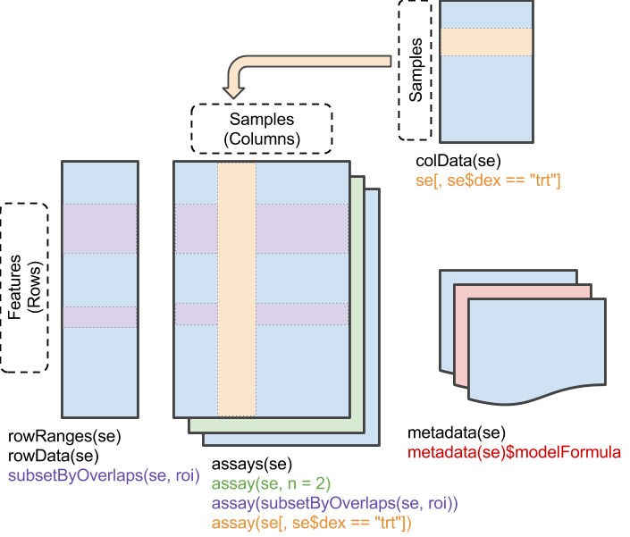

## Overview

**Objective:** get comfortable with R starting from zero, compute and interpret
simple descriptive statistics, and meet the `SummarizedExperiment`, the central
data structure for genomic experiments in Bioconductor.

**What you will learn:**

* how to use RStudio and write R scripts
* the basic building blocks of R: objects, functions, vectors, data frames
* how to compute mean, median, variance, and standard deviation, and when to prefer one over another
* how to import, explore, subset, and summarize a real dataset
* how to make simple plots with base R and `ggplot2`
* how an RNA-seq experiment is stored in a `SummarizedExperiment`


## Getting started

### Setup

Download the data files for this lab and save them in a folder called `data`
inside your working folder:

* [ALLphenoData.tsv](data/ALLphenoData.tsv)
* [BRFSS-subset.csv](data/BRFSS-subset.csv)
* [airway-read-counts.csv](data/airway-read-counts.csv)
* [airway-sample-sheet.csv](data/airway-sample-sheet.csv)

*check airway*

### RStudio

When you open RStudio you see four panels:

* the **console** (bottom left), where R executes commands;
* the **script editor** (top left), where you write code that you want to keep;
* the **environment** (top right), which lists the objects you have created;
* the **files / plots / help** panel (bottom right).

A few habits that will save you time:

* Always write your code in a **script** (*File → New File → R Script*) and save it.
  Run the current line, or the selected lines, with `Ctrl + Enter`
  (`Cmd + Enter` on a Mac).
* Everything after a `#` is a **comment** and is ignored by R. Use comments to
  explain to your future self what the code does.

## R basics

### R as a calculator

The simplest thing you can do with R is arithmetic.

```{r calculator}
2 + 3
10 / 4
2^10
(1 + 2) * 3   # parentheses work as usual
sqrt(16)
log(100)      # natural logarithm
log10(100)
exp(1)
```

### Objects and assignment

Results can be stored in **objects** using the assignment operator `<-`
(read it as "gets").

```{r assignment}
weight_kg <- 70
height_m <- 1.75
bmi <- weight_kg / height_m^2
bmi
```

Some rules about object names:

* they can contain letters, numbers, `.` and `_`, but cannot start with a number;
* R is **case-sensitive**: `bmi` and `BMI` are two different objects;
* choose names that describe the content (`height_m` is better than `x`).

`ls()` lists the objects in your environment, `rm()` removes one.

```{r ls}
ls()
rm(bmi)
ls()
```

### Functions and help

A **function** takes some inputs (*arguments*), does something, and returns an
output. We have already used `sqrt()` and `log()`. Arguments can be given by
position or by name; many arguments have default values.

```{r functions}
round(3.14159)              # default: digits = 0
round(3.14159, digits = 2)  # named argument
log(1:5)                    # default base = exp(1)
log(1:5, base = 10)
```

To read the documentation of a function, use `?`. The **Usage** section shows
the arguments and their defaults, and the **Examples** at the bottom of the
page can be copied and run.

```{r help, eval=FALSE}
?round
?mean
```

### Vectors

The basic data structure in R is the **vector**, an ordered collection of
values of the same type. Vectors are created with `c()` ("combine").

```{r vectors}
expr <- c(5.2, 6.1, 4.8, 7.3, 5.9)   # expression of a gene in 5 samples
expr
length(expr)
1:10
seq(0, 1, by = 0.25)
rep("ctrl", times = 3)
```

Most operations in R are **vectorized**: they are applied to each element.

```{r vectorized}
expr * 2
expr - mean(expr)
log2(expr)
```

You extract elements with square brackets `[ ]`.

```{r indexing}
expr[1]          # first element
expr[c(1, 3)]    # first and third
expr[2:4]        # from second to fourth
expr[-1]         # all but the first
```

### Types of data

Every vector has a type. The most common ones are numeric, character, and
logical. `class()` tells you the type of an object.

```{r types}
class(expr)
genes <- c("TP53", "BRCA1", "MYC")
class(genes)
is_up <- c(TRUE, FALSE, TRUE)
class(is_up)
```

A vector can contain only one type: if you mix them, R converts everything to
the most general type.

```{r coercion}
c(1, "a", TRUE)
```

Categorical variables are stored as **factors**, which know the set of
possible values (the *levels*).

```{r factors}
group <- factor(c("ctrl", "trt", "trt", "ctrl", "trt"))
group
levels(group)
table(group)
```

### Comparisons and logical vectors

Comparisons return logical vectors, which are very useful for selecting data.

```{r logical}
expr > 5.5
expr[expr > 5.5]            # keep only the values above 5.5
sum(expr > 5.5)             # TRUE counts as 1: how many values are above 5.5?
which(expr > 5.5)           # positions of those values
expr > 5 & expr < 6         # AND
expr < 5 | expr > 7         # OR
genes %in% c("MYC", "KRAS") # is each element in a set?
```

### Missing values

Missing data are represented by `NA` ("not available"). Any calculation
involving an `NA` gives `NA`, unless you tell the function to remove them.

```{r na}
expr_na <- c(5.2, NA, 4.8, 7.3, 5.9)
mean(expr_na)
mean(expr_na, na.rm = TRUE)
is.na(expr_na)
sum(is.na(expr_na))         # how many missing values?
```

### Data frames

A **data frame** is a table: each column is a vector (a variable), and all
columns have the same length (one row per observation). R comes with some
example datasets. `PlantGrowth` contains the dry weight of plants grown in a
control condition and under two treatments.

```{r dataframe}
PlantGrowth
head(PlantGrowth)
dim(PlantGrowth)      # number of rows and columns
str(PlantGrowth)      # structure: type of each column
summary(PlantGrowth)
```

Columns are extracted with `$`; rows and columns with `[row, column]`.

```{r dataframe-subset}
PlantGrowth$weight
PlantGrowth[1:3, ]                            # first three rows, all columns
PlantGrowth[, "group"]                        # one column
PlantGrowth[PlantGrowth$group == "ctrl", ]    # rows of the control group
```

You can also build a data frame yourself.

```{r dataframe-create}
samples <- data.frame(
    sample = c("S1", "S2", "S3", "S4", "S5"),
    group = group,
    expr = expr
)
samples
```

### Packages

Packages extend R with new functions and data. They are **installed** once
with `install.packages()` (or `BiocManager::install()` for Bioconductor
packages), and **loaded** in every new session with `library()`.

```{r packages}
library(ggplot2)
```


## Descriptive statistics

Before any statistical test, we describe the data: where is the "center" of the
distribution, and how much do the values vary around it?

We use the plant weights of the control group.

```{r ctrl}
ctrl <- PlantGrowth$weight[PlantGrowth$group == "ctrl"]
ctrl
```

### Measures of location: mean and median

The **mean** is the sum of the values divided by their number,
$\bar{x} = \frac{1}{n}\sum_{i=1}^n x_i$.

```{r mean}
sum(ctrl) / length(ctrl)   # by hand
mean(ctrl)                 # built-in function
```

The **median** is the value in the middle once the data are sorted: half of the
observations are below it and half above. With an even number of observations
it is the average of the two central values.

```{r median}
sort(ctrl)
median(ctrl)
```

The two measures behave very differently when the data contain extreme values.
Suppose that a weight was mistyped as 51.7 instead of 5.17.

```{r robustness}
ctrl_typo <- ctrl
ctrl_typo[2] <- 51.7

mean(ctrl);   mean(ctrl_typo)
median(ctrl); median(ctrl_typo)
```

The mean is pulled towards the outlier, while the median barely changes: the
median is **robust** to outliers. This matters a lot with genomic data, which
are often very skewed (we will see an example with RNA-seq counts at the end
of this lab).

### Measures of spread: variance and standard deviation

The **variance** measures how far the values are, on average, from the mean.
The sample variance is

$$
s^2 = \frac{1}{n-1}\sum_{i=1}^n (x_i - \bar{x})^2.
$$

We divide by $n-1$ rather than $n$ because we estimate the mean from the same
data; with this correction, $s^2$ is an unbiased estimate of the population
variance. Let's compute it step by step.

```{r variance}
deviations <- ctrl - mean(ctrl)    # distance of each value from the mean
deviations
sum(deviations)                    # always 0 (up to rounding)! that's why we square them
sum(deviations^2) / (length(ctrl) - 1)
var(ctrl)
```

The variance is expressed in squared units (here, squared grams). The
**standard deviation** is its square root, and has the same unit as the data.

```{r sd}
sqrt(var(ctrl))
sd(ctrl)
```


### Summaries by group

A boxplot shows median, quartiles, and potential outliers for each group in one
picture. Note the **formula** notation `weight ~ group`, read as "weight as a
function of group".

```{r boxplot}
boxplot(weight ~ group, data = PlantGrowth,
        ylab = "Dry weight", col = "lightblue")
```


## Case study: ALL phenotypic data

We now work with a real dataset: clinical information about patients with
acute lymphoblastic leukemia (ALL).

### Data input

The file is tab-separated, so we use `read.delim()`. Check `?read.delim` for
other options, and `read.csv()` for comma-separated files.

```{r all-input}
pdata <- read.delim("data/ALLphenoData.tsv")
```

Explore the basic properties of the object we just created.

```{r all-explore}
class(pdata)
dim(pdata)
colnames(pdata)
head(pdata)
```

Note that R modified some column names (e.g., `t(4;11)` became `t.4.11.`)
to make them valid object names.

Character variables such as `sex` are best summarized with `table()`;
`useNA = "ifany"` also counts missing values.

```{r all-summary}
table(pdata$sex, useNA = "ifany")
summary(pdata$age)
summary(pdata$cyto.normal)
```

### Subsetting

Remind yourself of the various ways to subset a data frame.

```{r all-subset}
pdata[1:5, 3:4]
head(pdata[, 3:5])
tail(pdata[, 3:5], 3)
head(pdata$age)
head(pdata[pdata$age > 21, ])
```

It seems from below that there are 17 females over 40 y (`pdata$age`) in the dataset, but when
subsetting `pdata` to contain just those individuals, 19 rows are selected. Why?

```{r all-puzzle}
idx <- pdata$sex == "F" & pdata$age > 40
table(idx)
dim(pdata[idx, ])
```

::: {.callout-tip collapse="true" title="Solution"}

Some patients have a missing `sex` or `age`, so `idx` contains `NA` values.
Indexing a data frame with `NA` returns a row full of `NA`s. Wrapping the
condition in `which()` keeps only the `TRUE` positions.

```{r}
#| code-fold: true

table(idx, useNA = "ifany")
dim(pdata[which(idx), ])
```

:::

### Factors

The `mol.biol` column describes the molecular subtype of each tumor. Keep only
the patients with `BCR/ABL` or `NEG`, and convert the column to a factor.

```{r all-bcrabl}
bcrabl <- pdata[pdata$mol.biol %in% c("BCR/ABL", "NEG"), ]
bcrabl$mol.biol <- factor(bcrabl$mol.biol)
table(bcrabl$mol.biol)
```

The `BT` column describes B- and T-cell subtypes. We can collapse `B1`, `B2`, …
into `B` and `T1`, `T2`, … into `T` by renaming the levels with their first
letter: levels with the same new name are merged.

```{r all-bt}
bcrabl$BT <- factor(bcrabl$BT)
levels(bcrabl$BT)
table(bcrabl$BT)
levels(bcrabl$BT) <- substring(levels(bcrabl$BT), 1, 1)
table(bcrabl$BT)
```

`xtabs()` counts the number of samples for each combination of two variables.

```{r all-xtabs}
xtabs(~ BT + mol.biol, bcrabl)
```

### Summaries and a first test

`aggregate()` computes a summary for each combination of groups, using the
formula notation.

```{r all-aggregate}
aggregate(age ~ mol.biol + sex, bcrabl, mean)
```

Is the age different between `BCR/ABL` and `NEG` patients? We visualize it
with a boxplot and compare the means with a t-test.

```{r all-ttest}
boxplot(age ~ mol.biol, bcrabl, ylab = "Age (years)")
t.test(age ~ mol.biol, bcrabl)
```


## Case study: weighty matters

This case study is a second walk through data manipulation and visualization.
We use data from the US Center for Disease Control's Behavioral Risk Factor
Surveillance System (BRFSS) annual survey: a random sample of 10000
individuals from each of 1990 and 2010.

### Data input and base plots

```{r brfss-input}
brfss <- read.csv("data/BRFSS-subset.csv")
brfss$Sex <- factor(brfss$Sex)
brfss$Year <- factor(brfss$Year)
dim(brfss)
head(brfss)
summary(brfss)
```

How many males and females in each year?

```{r brfss-xtabs}
xtabs(~ Sex + Year, brfss)
```

A scatterplot of the square root of weight versus height. The square root
makes the distribution of weights more symmetric.

```{r brfss-plot}
plot(sqrt(Weight) ~ Height, brfss, main = "All Years, Both Sexes")
```

We can color the points by sex: indexing a vector of colors with a factor uses
the level of each observation (here `Female` = 1, `Male` = 2). With many points,
small symbols (`pch = 20`) and semi-transparent colors reduce over-plotting.

```{r brfss-plot-col}
cols <- adjustcolor(c("tomato", "steelblue"), alpha.f = 0.3)
plot(sqrt(Weight) ~ Height, brfss, col = cols[brfss$Sex], pch = 20,
     main = "All Years, Both Sexes")
legend("topleft", legend = levels(brfss$Sex), col = cols, pch = 20)
```

Two panels in one figure, with `par(mfcol = ...)`:

```{r brfss-panels}
brfss2010 <- brfss[brfss$Year == "2010", ]
opar <- par(mfcol = c(1, 2))
plot(sqrt(Weight) ~ Height, brfss2010[brfss2010$Sex == "Female", ],
     main = "2010, Female")
plot(sqrt(Weight) ~ Height, brfss2010[brfss2010$Sex == "Male", ],
     main = "2010, Male")
par(opar)   # reset 'par' to its original value
```

### Missing values

Some heights and weights are missing. Let's count them and remove those rows.

```{r brfss-na}
sum(is.na(brfss$Height))
sum(is.na(brfss$Weight))
drop <- is.na(brfss$Height) | is.na(brfss$Weight)
sum(drop)
brfss <- brfss[!drop, ]
```

### ggplot2 graphics

`ggplot2` builds a plot layer by layer: we specify the data, the *aesthetic
mapping* (which variable goes on which axis, which one defines the color, …)
with `aes()`, and then one or more *geometries* (`geom_point()`,
`geom_boxplot()`, …), combined with `+`.

```{r ggplot-basic}
ggplot(brfss, aes(x = Height, y = sqrt(Weight))) +
    geom_point() +
    ylab("Square root of Weight") +
    ggtitle("All Years, Both Sexes")
```

Color the female and male points differently, or plot them in different panels
with `facet_grid()`.

```{r ggplot-color}
ggplot(brfss, aes(x = Height, y = sqrt(Weight), color = Sex)) +
    geom_point(alpha = 0.4)

ggplot(brfss, aes(x = Height, y = sqrt(Weight), color = Sex)) +
    geom_point(alpha = 0.4) +
    facet_grid(Sex ~ .)
```

Density curves of weight for males and females in 2010:

```{r ggplot-density}
brfss2010 <- brfss[brfss$Year == "2010", ]
ggplot(brfss2010, aes(x = sqrt(Weight), fill = Sex)) +
    geom_density(alpha = 0.25)
```

A partially specified plot can be saved in an object and completed later.
Here we add a linear regression line, with its 95% confidence band, for each
sex.

```{r ggplot-smooth}
sps <- ggplot(brfss, aes(x = Height, y = sqrt(Weight), color = Sex)) +
    geom_point(alpha = 0.4) +
    scale_color_brewer(palette = "Set1")
sps + geom_smooth(method = "lm")
```

### Group summaries with dplyr

The `dplyr` package offers a readable way to compute summaries by group.
The **pipe** `|>` passes the object on its left as the first argument of the
function on its right, so you can read the code as a sequence of steps:
"take `brfss`, then group by sex and year, then summarize".

```{r dplyr}
library(dplyr)

brfss |>
    dplyr::group_by(Sex, Year) |>
    dplyr::summarize(
        n = n(),
        mean_weight = mean(Weight),
        median_weight = median(Weight),
        sd_weight = sd(Weight)
    )
```


## Genomic data: the SummarizedExperiment

### Why a dedicated data structure?

In a genomic experiment we typically have:

* a **matrix of measurements**, with one row per feature (gene, transcript, …) and one column per sample, e.g., RNA-seq read counts;
* a table describing the **samples** (the *sample sheet*): treatment, cell line, batch, …;
* a table describing the **features**: gene names, genomic coordinates, …

We could keep these as three separate objects, but it is very easy to make
mistakes: if we remove a sample from the count matrix and forget to remove it
from the sample sheet, the two are no longer aligned. The Bioconductor
`SummarizedExperiment` class keeps the three pieces together, so that
subsetting the object subsets all of them consistently.



* `assay()` / `assays()`: the matrix (or matrices) of measurements;
* `colData()`: information about the samples (columns);
* `rowData()` / `rowRanges()`: information about the features (rows);
* `metadata()`: information about the experiment as a whole.

### The airway experiment

We use an RNA-seq experiment on airway smooth muscle cells from four donors
(the `cell` column), each treated (`trt`) or not (`untrt`) with dexamethasone
(the `dex` column), a corticosteroid used to treat asthma.

First, we read the read counts. In the file, each row is a sample and each
column a gene, so we transpose the table with `t()` to have genes in rows, as
expected by Bioconductor.

```{r airway-counts}
counts_df <- read.csv("data/airway-read-counts.csv", row.names = 1)
dim(counts_df)
counts_df[, 1:4]

counts <- t(as.matrix(counts_df))
dim(counts)
head(counts)
```

Then we read the sample sheet, and use the run identifier as row names so
that they match the column names of the count matrix.

```{r airway-samples}
sample_sheet <- read.csv("data/airway-sample-sheet.csv")
rownames(sample_sheet) <- sample_sheet$Run
sample_sheet$dex <- factor(sample_sheet$dex, levels = c("untrt", "trt"))
sample_sheet

## always check that samples are in the same order!
identical(colnames(counts), rownames(sample_sheet))
```

Now we put everything together.

```{r airway-se}
library(SummarizedExperiment)
se <- SummarizedExperiment(
    assays = list(counts = counts),
    colData = sample_sheet
)
se
```

### Exploring the object

```{r se-explore}
dim(se)
assayNames(se)
assay(se, "counts")[1:5, ]
colData(se)
se$dex          # shortcut for colData(se)$dex
```

Subsetting works like for a data frame, `[genes, samples]`, and the
sample sheet follows the counts automatically.

```{r se-subset}
se_untrt <- se[, se$dex == "untrt"]
se_untrt
colData(se_untrt)

se[1:10, 1:2]
```

### Descriptive statistics on counts

The **library size** of a sample is the total number of reads assigned to
genes, i.e., the sum of each column.

```{r libsize}
lib_size <- colSums(assay(se))
lib_size
```

Library sizes differ between samples for technical reasons (how deeply each
sample was sequenced), not because of biology. To compare samples, we divide
each column by its library size and multiply by one million, obtaining
**counts per million** (CPM). `sweep()` applies an operation to each column
of a matrix. A `SummarizedExperiment` can store several assays with the same
dimensions.

```{r cpm}
assay(se, "cpm") <- sweep(assay(se, "counts"), 2, lib_size, "/") * 1e6
assayNames(se)
colSums(assay(se, "cpm"))   # now every sample sums to one million
```

Let's look at one gene, *DUSP1* (`ENSG00000120129`), known to respond to
glucocorticoids.

```{r gene}
dusp1 <- assay(se, "cpm")["ENSG00000120129", ]
dusp1


boxplot(dusp1 ~ se$dex, ylab = "DUSP1 (CPM)", xlab = "")
stripchart(dusp1 ~ se$dex, vertical = TRUE, add = TRUE, pch = 19)
```

We can also store gene-level summaries in `rowData()`, so that they stay
attached to the right gene.

```{r rowdata}
rowData(se)$mean_count <- rowMeans(assay(se, "counts"))
rowData(se)$var_count <- apply(assay(se, "counts"), 1, var)
rowData(se)
```

## Further reading

* Software Carpentry, [R for Reproducible Scientific Analysis](https://swcarpentry.github.io/r-novice-gapminder/)
* S. Holmes and W. Huber, [Modern Statistics for Modern Biology](https://www.huber.embl.de/msmb/)
* [SummarizedExperiment vignette](https://bioconductor.org/packages/release/bioc/vignettes/SummarizedExperiment/inst/doc/SummarizedExperiment.html)

## Acknowledgements

This lab is adapted from material by Martin Morgan, Sonali Arora, Lori
Shepherd, and Davide Risso for Bioconductor courses.
