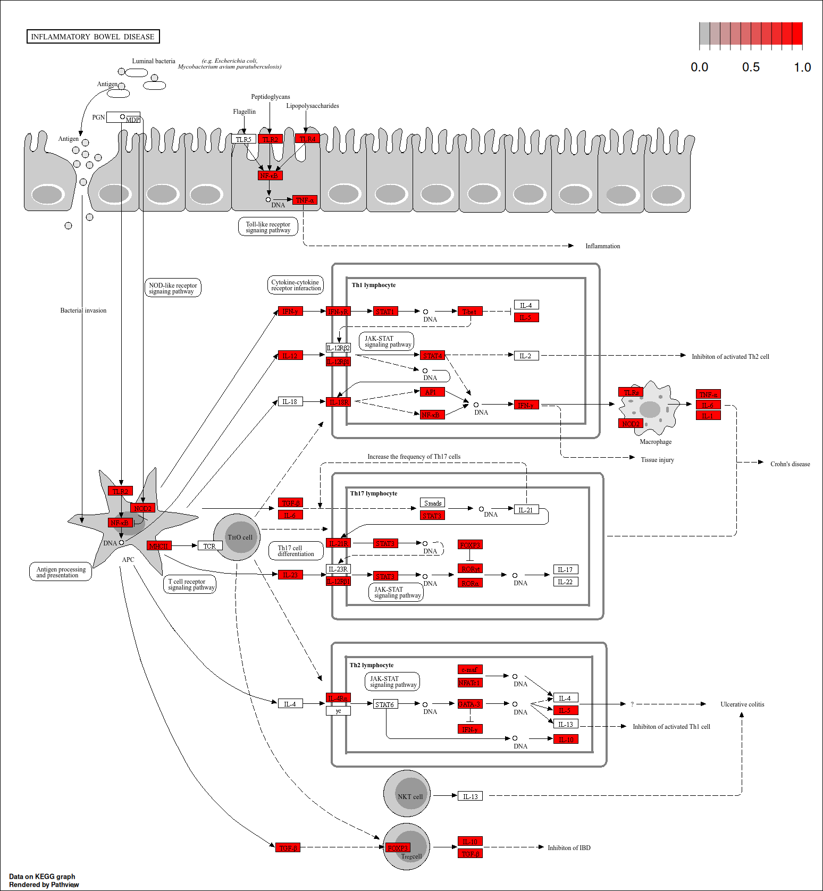

```{r include = FALSE}
knitr::opts_chunk$set(echo = TRUE, message=FALSE, warning = FALSE, fig.width=8, fig.height=6, fig.path = "fig/Inference-")
```

# Introduction

After normalization we can proceed with the differential expression genes identification. Differentially expressed gene (DEG) identification is the process of finding genes whose expression levels differ significantly on average between biological conditions. The **edgeR** package will use to the identification.

```{r, message=FALSE}
library(dplyr)
library(plyr)
library(EDASeq)
library(limma)
library(edgeR)
library(genefilter)
library(ggplot2)
library(ggrepel)
library(pheatmap)
library(cluster)
```

We load the .RData object from the previous tutorial.

```{r}
load("normalization.RData")
```

```{r}
# colnames <- colnames(tmm)
# colnames(tmm) <- substr(colnames(tmm), 9, 12)
```

The biological question is to identify the transcriptional differences between the two LUAD subtypes: proximal-inflammatory (prox.-inflam) and proximal-proliferative (prox.-prolif). The subtype information is stored in the `paper_expression_subtype` variable.

```{r}
table(luad_sel$paper_expression_subtype)

# Remove the third category
luad_prox <- luad_sel[, luad_sel$paper_expression_subtype != "TRU"]
luad_prox$paper_expression_subtype <- as.character(luad_prox$paper_expression_subtype)
```

# Exploring the mean-variance relationship

First we explore the *mean-variance* relationship on our dataset.

In RNA-seq data the variance is typically larger than the mean, a phenomenon called overdispersion. The distribution for over-dispersed counts is the Negative Binomial distribution (NB), where $Var(Y)=μ+ϕμ^2$ (quadratic relationship between the mean and the variance).

To estimate the dispersion we'll use **edgeR** package.

```{r, message=FALSE}
design <- model.matrix(~ paper_expression_subtype, data = colData(luad_prox))
head(design)
# Create a DGEList object
dge <- DGEList(assay(luad_prox, "raw_count"))
```

Then, scaling factors are computed using the `calcNormFactors()` function to convert the observed library sizes into normalized values.

The effective library sizes used in downstream analyses are calculated as `lib.size * norm.factors`, where `lib.size` contains the original library sizes and `norm.factors` is the vector of scaling factors computed by this function. The effective library sizes are incorporated into the model that estimates dispersion. The function `plotMeanVar()` in edgeR is used to visualize the relationship between gene expression levels (mean) and variability (variance).

```{r, message=FALSE}
dge <- calcNormFactors(dge, method="TMM")
dge <- estimateDisp(dge, design)

plotMeanVar(dge, show.raw.vars = TRUE, show.ave.raw.vars = F, NBline = TRUE, show.tagwise.vars = TRUE)
```

Each dot represents a gene. The x-axis shows the average expression level (mean), and the y-axis shows the variance. Both axes are on a log scale.

The black line represents the linear mean–variance relationship expected under a Poisson distribution, while the blue line represents the mean–variance trend under the negative binomial distribution. As gene expression increases, the variance also increases. Most points lie above the black line, indicating that the data are more variable than expected under a Poisson model. The blue line follows the cloud of points much more closely, suggesting that the negative binomial model provides a better fit.

The grey points represent the observed (raw) variances, while the dispersion estimates gene by gene are represented by the light blue dots.

```{=html}
<style>
  div.blue{background-color:#e6f0ff; border-radius: 4px; padding: 15px;}
  div.pink{background-color:#ffffcc; border-radius: 4px; padding: 15px;}
</style>
```

# Identification of differentially expressed genes

The `glmFit()` function estimates the parameters of a generalized linear model (GLM). After normalization, the counts are effectively adjusted through scaling factors. To account for these normalized library sizes, an offset is included in the GLM: $log(E[Y|X]) = X\beta + O$, where $log(E[Y|X])$ is the link function for negative binomial distribution and $X\beta$ represents the linear predictor, and $O$ is the offset that incorporates the effective library sizes.

```{r, message=FALSE}
fit <- glmFit(dge, design)
fit$offset[,1:20]
```

Once the model parameters have been estimated, we can perform the differential expression test for each gene, using the `glmLRT()` function. By specifying `coef = 2` (prox.-proliferative vs prox.-inflammatory), the null hypothesis is $H0:\beta_2=0$, which tests whether the effect of this condition is significantly different from zero. Let's see the first ten differentially expressed genes sorted by log fold-change (*logFC*), using the `topTags()` function:

```{r, message=FALSE}
res <- glmLRT(fit, coef=2)
topTags(res, sort.by="logFC")
```

For each gene:

-   **logFC** measures how much the gene changes between the two conditions;
-   **logCPM** is the average expression
-   **LR** is the test statistic
-   **P-value** is the p-value
-   **FDR** is adjusted p-value (multiple testing)

Let's visualize the number of differentially expressed genes using a threshold of $FDR<0.05$:

```{r, message=FALSE}
tab <- topTags(res, n=Inf)
tab <- tab$table
head(tab)

de <- tab[tab$FDR <0.05,]
dim(de)
```

# DEGs exploration

## MD plot

First, we visualize the MD plot, comparing the log-fold changes (**logFC**) with the average log counts per million (**logCPM**). Black points correspond to non-significant genes, while red and blue points indicate up- and down-regulated genes, respectively.

```{r, message=FALSE}
plotMD(res)
```

## Volcano plot

A volcano plot is a graphical representation of **logFC** vs **-log10(PValue)** with the possibility to highlight some genes of interest

```{r, message=FALSE}
names <- row.names(de)

tab$sign <- NA
tab$sign[tab$logFC < 0] <- "Down"
tab$sign[tab$logFC > 0] <- "Up"
tab$sign[tab$FDR >= 0.05] <- "NoSig"
tab$gene <- rownames(tab)

ggplot(tab, aes(x = logFC, y = -log10(PValue), color = sign)) + geom_point() + theme_classic() +
  scale_color_manual(values = c("Down" = "blue", "Up" = "red", "NoSig" = "black")) +
  geom_text_repel(data = tab[1:20, ], aes(label = gene), size = 2.5, max.overlaps = 20) 
```

## P-value distribution

Last, we check the distribution of the *p-values*. In an unbiased situation we expect a peak on low values mixed with a uniform distribution. 

```{r, message=FALSE}
hist(tab$PValue, main="p-values distribution")
```

# Enrichment 

```{r message=FALSE, warning=FALSE}
library(knitr)
library(EDASeq)
library(dplyr)
library(plyr)
library(edgeR)
library(DESeq2)
library(limma)
library(clusterProfiler)
library(pathview)
library(AnnotationDbi)
library(org.Hs.eg.db)
library(ReactomePA)
library(enrichplot)
library(ggnewscale)
library(ggupset)
library(ggridges)
```

We will use genes found to be significantly differential expressed between prox.prolif vs prox.inflam the variable **paper_expression_subtype** to perform gene set enrichment analyses. 


# Gene Set Analysis with ORA Method 
Over-Representation Analysis (ORA) tests whether a gene set is statistically over-represented in your DEG list compared to what you would expect by chance, given the size of the universe. 

To check if there are Gene Ontology categories or biological pathways enriched in our DEG list we will use the **ClusterProfiler** package and the functions *enrichKEGG* (for KEGG pathways), *enrichPathway* (for Reactome pathway) and *enrichGO* (for Gene Ontology categories). All these function implement the Fisher exact test.

First of all we need to create the ID list of i (the differentially expressed genes) and of j, the reference universe (all the quantified genes):
```{r}
top <- topTags(res, n = Inf)$table
deg <- top[top$FDR <= 0.05,]
dim(deg)
```

```{r, message=FALSE}
universo <- row.names(top)
sign <- row.names(deg)

universo.entrez <- mapIds(org.Hs.eg.db, # genome wide annotation for Human that contains Entrez Gene identifiers
                    keys = universo, #Column containing Ensembl gene ids
                    column = "ENTREZID",
                    keytype = "ENSEMBL")  

sign.entrez <- mapIds(org.Hs.eg.db,
                    keys = sign, #Column containing Ensembl gene ids
                    column = "ENTREZID",
                    keytype = "ENSEMBL")
universo.entrez <- as.character(universo.entrez)
sign.entrez <- as.character(sign.entrez)


length(sign.entrez)
length(universo.entrez)
```

## KEGG pathways

With the ID vectors that we have created previously we can estimate the enrichment scores on all the available KEGG pathways:

```{r message=FALSE}
kk <- enrichKEGG(gene = sign.entrez,
                 universe = universo.entrez,
                 organism = 'hsa',
                 keyType = 'ncbi-geneid',
                 pvalueCutoff = 0.05,
                 pAdjustMethod = "BH")
dim(kk)
kk@result[1:10,]

```

```{r}
barplot(kk) #Quickly rank terms by the number of genes involved
dotplot(kk) #Useful when you want to distinguish between a term that is significant but contains few of your genes vs. one where your DEGs dominate the pathway.
cnetplot(kk) # Useful to see gene overlap between terms and identify multi-pathway genes
heatplot(kk, showCategory = 10) #Reveals which genes are shared across multiple terms and which are unique to one pathway

edo <- pairwise_termsim(kk)
emapplot(edo) #Enrichment Map, terms are nodes; edges connect terms that share genes
obj <- upsetplot(edo, 8)
obj #Use this to understand the unique vs. shared gene membership across enriched categories.
```

Let's give a look at the genes that belong to the pathway with ID **hsa05321**. We will use the **pathview** function from the *pathview* package:

```{r message=FALSE}
pathview(gene.data = sign.entrez, pathway.id = "hsa05321", species = "hsa")

```

Try to compute the pathway analysis using Reactome database (*enrichPathway* function) and Gene Ontology (*enrichGO* function; specify Biological Process (BP) as category). 

## Reactome database

```{r message=FALSE}
kk <- enrichPathway(gene = sign.entrez,
                 universe = universo.entrez,
                 organism = 'human',
                 pvalueCutoff = 0.05,
                 pAdjustMethod = "BH")
kk@result[1:10, 1:6]
```

```{r}
barplot(kk)
dotplot(kk)
cnetplot(kk)
heatplot(kk, showCategory = 10)

edo <- pairwise_termsim(kk)
emapplot(edo)
upsetplot(edo, 5)
```

## Gene Ontology categories

We run the same analyses using GO terms using the Biological Process (BP) the  Molecular function (MF) and the Cellular component (CC) categories:

```{r message=FALSE}
ego <- enrichGO(gene = sign.entrez,
              universe = universo.entrez,
              OrgDb = 'org.Hs.eg.db',
              keyType = "ENTREZID",
              ont = "BP",
              pvalueCutoff = 0.05,
              pAdjustMethod = "BH",
              readable = TRUE)

dim(ego@result[1:10])
```

```{r}
barplot(ego)
upsetplot(ego, 5)
```

# GSEA (Gene Set Enrichment Analysis) method

GSEA (Gene Set Enrichment Analysis) does not require a binary DEG/non-DEG threshold.
Instead, it works on the full ranked gene list: all quantified genes are sorted by a continuous statistic (logFC), and the algorithm asks whether the members 
of a given gene set tend to cluster at the top (up-regulated) or 
bottom (down-regulated) of this ranking, beyond what is expected by chance. This makes it more sensitive to moderate changes across a pathway.


```{r}
tt <- top$logFC
names(tt) <- universo.entrez

table(duplicated(names(tt)))
tt <- tt[!duplicated(names(tt))]
table(duplicated(names(tt)))

sort_tt <- sort(tt, decreasing = TRUE)
```

Below we will see the results for KEGG and GO only but with  **gsePathway** function we can obtain the results for Reactome pathways.

## KEGG pathway

The function to perform the analysis is **gseKEGG**:

```{r}
kk2 <- gseKEGG(geneList = sort_tt,
              organism = "hsa",
              pvalueCutoff = 0.05)

kk2@result[1:10, 1:7] # The key output is the Normalized Enrichment Score (NES)
```

The distribution of the statistics in the various gene sets:

```{r}
gseaplot(kk2, geneSetID = "hsa03040") #Gene set enriched in down-regulated genes
ridgeplot(kk2, label_format = 50, showCategory = 20) #Shows the distribution of the ranking statistic (logFC) for genes belonging to each enriched gene set. Useful for interpreting the direction of enrichment in GSEA results.
```
```{r}
gseaplot(kk2, geneSetID = "hsa00053") #Gene set enriched in top-regulated genes
```

The same analyzes can be performed on the Gene Ontology, here we will use only BP (biological processes) but you can perform the analyses using all the categories (MF and CC)

## GO categories

```{r}
kkGO <- gseGO(geneList = sort_tt,
          ont = "BP",
          OrgDb='org.Hs.eg.db',
          keyType = "ENTREZID",
          pAdjustMethod = "BH")

kkGO@result[1:10, 1:6]
```

Let's see the distribution of the statistics in the various gene sets:

```{r}
gseaplot(kkGO, geneSetID = "GO:0006334")
ridgeplot(kkGO, label_format = 50, showCategory = 20) # all shown gene sets are significant well beyond the resolution of the test --> To rank and interpret results look at the NES instead of the p.adjust
dotplot(kkGO)
```


```{r}
#| eval: false
#| include: true
save("deg_enrichment.RData")
```


